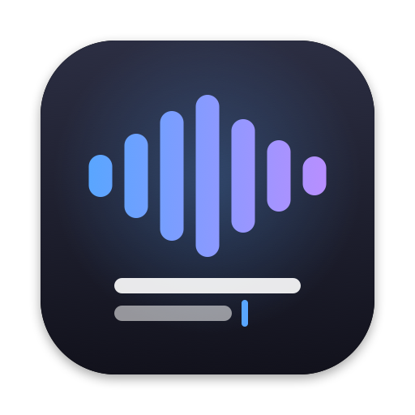
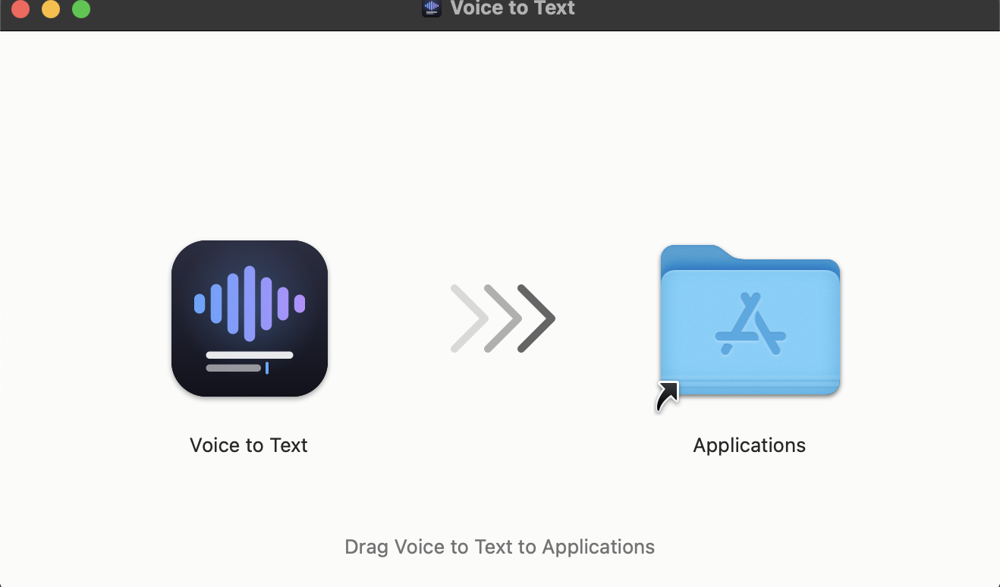
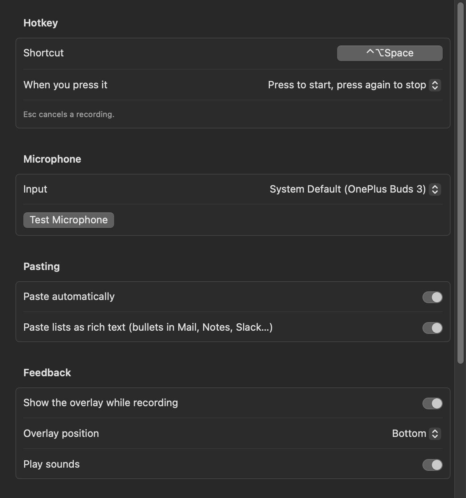
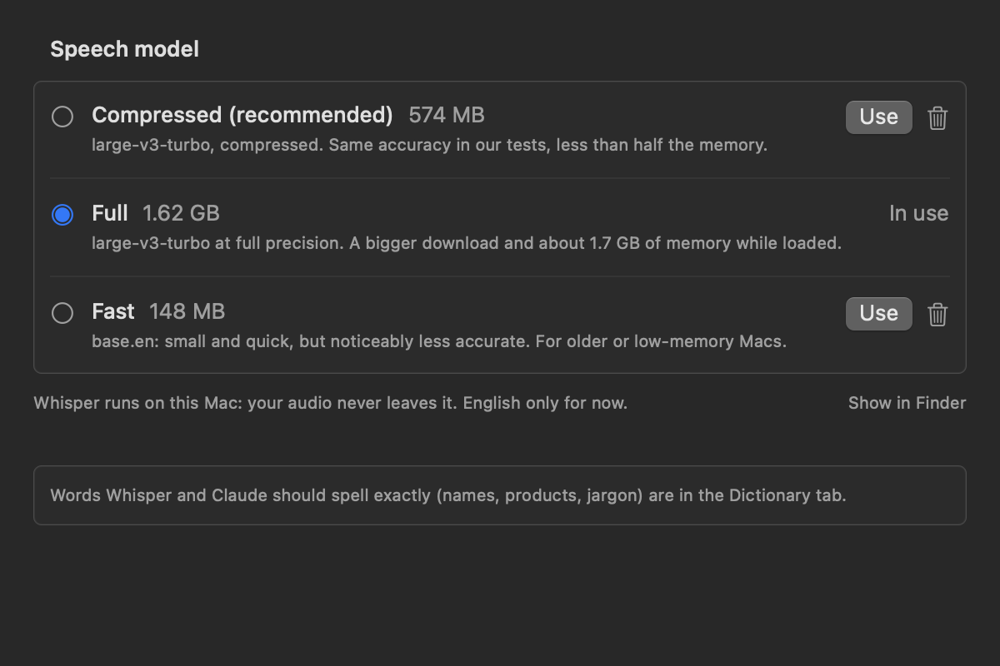
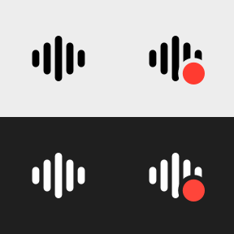

<p align="center">
  
</p>

<h1 align="center">Voice to Text</h1>

<p align="center">
  <strong>Free, open-source dictation for macOS that uses the AI subscription you already have.</strong>
</p>

<p align="center">
  <a href="https://github.com/mahfuzur/voice-to-text/releases/latest">Download for Mac</a> ·
  <a href="#install">Install</a> ·
  <a href="#usage">Usage</a> ·
  <a href="#privacy">Privacy</a> ·
  <a href="docs/ROADMAP.md">Roadmap</a>
</p>

Press a hotkey, speak, and press it again. Clean, well-formatted text appears in whatever app you're typing into.
Speech is transcribed **on your Mac** with [whisper.cpp](https://github.com/ggml-org/whisper.cpp). The polishing step
(removing filler words, fixing punctuation, formatting numbers, lists and email addresses) runs through your own
[Claude Code](https://docs.anthropic.com/en/docs/claude-code) CLI, so it uses your existing Claude subscription.
**No API keys, no word limits, and no extra subscription.**

<p align="center">
  
  
</p>

## Features

- **Works in any app:** Slack, Mail, VS Code, the terminal, the browser. Text is pasted at the cursor, and your clipboard is restored afterwards.
- **Local transcription:** Whisper large-v3-turbo runs on-device. Audio never leaves your Mac.
- **Smart cleanup:**
  - Removes "um", "uh" and false starts.
  - Applies self-corrections: "Friday, no wait, Thursday" becomes "Thursday".
  - Writes numbers properly: $15,400 · 15% · 2:30 PM · March 3, 2026.
  - Turns spoken addresses into real ones: "john dot doe at gmail dot com" becomes john.doe@gmail.com, and `process_order` stays `process_order`.
  - Formats lists and paragraphs.
  - Carries out spoken commands such as "new paragraph" and "comma".
- **App-aware modes:** casual for chat apps, proper paragraphs for email, exact identifiers for code and terminals, lists for notes.
- **Dictionary:** teach it names and terms, and fix words it keeps mishearing.
- **Floating indicator:** a live waveform while listening, then *Transcribing…* and *Polishing…*, and *✓ Pasted* when done.
- **Microphone picker and test**, with Bluetooth headsets handled. The built-in mic still transcribes more accurately.
- **Offline cleanup:** with no internet, or if Claude fails, [S1-mini by Superwhisper](https://huggingface.co/superwhisper/s1-mini-GGUF)
  cleans up the text on your Mac instead (English only). Pick **S1-mini** under **Clean Up With** to always stay on-device.
- **Easy to install:** a DMG with everything built in, and a first-run setup that downloads the models, finds or installs
  Claude Code, and walks you through the two permissions. No Homebrew or Terminal needed.
- **Settings window:** hotkey recorder, speech model manager, cleanup test, dictionary, and your own app → mode choices.
- **Fallback:** if cleanup fails, you still get the raw transcript. A dictation is never lost.

## Screenshots

<p align="center">
  
  <br><em>Install: drag the app to Applications. Setup takes care of the rest.</em>
</p>

<p align="center">
  
  
  <br><em>Settings: hotkey, microphone and pasting (left); speech models, downloaded and switched in one click (right).</em>
</p>

<p align="center">
  
  <br><em>The menu-bar icon: a red dot while it's recording or working, nothing else to watch.</em>
</p>

## Requirements

- macOS 13.3 or later on **Apple Silicon**.
- For cleanup with Claude: a Claude subscription. Setup installs the [Claude Code](https://docs.anthropic.com/en/docs/claude-code)
  CLI for you if it's missing (with Anthropic's official installer) and asks you to sign in.
  You can also use Voice to Text **without** Claude: S1-mini cleans up on your Mac, or turn cleanup off for the raw transcript.

## Install

1. Download `VoiceToText-<version>.dmg` from the [latest release](https://github.com/mahfuzur/voice-to-text/releases/latest),
   open it, and drag **Voice to Text** to **Applications**.
2. Open it from Applications. The first time, macOS says it can't check the app for malicious software, because the
   app isn't notarized by Apple yet. Click **Done**, then open **System Settings → Privacy & Security**, scroll down and click
   **Open Anyway** next to "Voice to Text was blocked". You only do this once; updates keep working.
3. The setup window walks you through the rest:
   - **Microphone** and **Accessibility** (to paste into other apps).
   - **Speech model:** Compressed (574 MB, recommended), Full (1.6 GB) or Fast (148 MB). It downloads while you continue.
   - **Cleanup:** it finds Claude Code, or offers to install it and sign you in (in Terminal, so you can see what runs).
     It also offers **S1-mini** (484 MB): with it, dictation works straight away, even offline, while Claude is being set up.
   - **Try it:** dictate into a box to check everything works.

What gets downloaded, and from where: the models come from Hugging Face ([whisper.cpp](https://huggingface.co/ggerganov/whisper.cpp),
[S1-mini](https://huggingface.co/superwhisper/s1-mini-GGUF)), each checked against its SHA-256, and are stored in
`~/.local/share/whisper` and `~/.local/share/s1-mini`. Claude Code comes from Anthropic's installer. Nothing else is installed.

### Build from source

You need the Xcode Command Line Tools (`xcode-select --install`; the full Xcode isn't needed) and `cmake`:

```bash
git clone https://github.com/mahfuzur/voice-to-text.git
cd voice-to-text

brew install cmake
./scripts/setup-signing.sh         # one time: a local signing identity, so macOS keeps permissions across rebuilds
./scripts/build-app.sh --install   # builds whisper.cpp and llama.cpp into the app (a few minutes the first time), installs it to /Applications and launches it
```

For the command-line `dictate` tool as well, run `brew install sox whisper-cpp` and `./scripts/install.sh`.

## Usage

| Action | How |
|---|---|
| Start dictating | **⌃⌥Space** (change it in **Settings → General**; any key combination works) |
| Stop and paste | **⌃⌥Space** again |
| Hold to talk instead | **Settings → General → When you press it**: hold ⌃⌥Space while you speak, release to paste |
| Cancel | **Esc** while recording |
| Copy the last result again | Menu → **Copy Last** |
| Change settings | Menu → **Settings…** (⌘,) |

The menu-bar icon shows a red dot from the moment you start recording until the text is pasted.

If you use Bluetooth earbuds, wait for the start sound before speaking. They take about 1.5 s to switch into headset mode.

### Modes

The mode is chosen from the app you're typing into (**Auto**). You can also fix a mode in the menu under **Mode**, and
choose the mode for any app yourself in **Settings → Modes**.

| Mode | Apps | Style |
|---|---|---|
| Chat | Slack, Teams, Discord, WhatsApp, Messages | Casual; no period at the end of one-liners |
| Email | Mail, Outlook, Spark, Superhuman | Paragraphs; dictated greetings and sign-offs on their own lines |
| Code | VS Code, Cursor, Xcode, JetBrains, Terminal, iTerm2, Warp, Ghostty | Exact file names, identifiers and commands |
| Notes | Notes, Notion, Obsidian, Bear, Pages, Word | Lists and short paragraphs |
| Default | Everything else, including browsers | Balanced |
| Raw | Chosen manually | No AI cleanup |

Lists are pasted as rich text, so apps like Notes, Mail and Slack show real bullets. Code mode always pastes plain text.

### Dictionary

Add words in **Settings → Dictionary**. It's saved in `~/.config/voice-to-text/dictionary.txt`, which you can also edit by hand:

```
# One term per line: Whisper and Claude will spell it exactly like this
Kubernetes
PostgreSQL

# Replacements, applied after cleanup: heard => wanted
cloud code => Claude Code
```

### Command line

The app is built around the script `scripts/dictate.sh`, which also works on its own (installed as `dictate`):

```bash
dictate            # toggle: start recording / stop and paste
dictate cancel     # stop and discard
dictate selftest   # synthetic speech through the whole pipeline (no mic, no paste)
dictate file x.wav # transcribe and clean up an existing recording
```

To use a hotkey without the app, bind `~/.local/bin/dictate` to a keyboard shortcut in the Shortcuts app or with
[skhd](https://github.com/koekeishiya/skhd). Give Microphone and Accessibility permission to whichever app runs it.

## How it works

```
hotkey ─► record (AVAudioEngine, 16 kHz WAV)
       ─► transcribe on-device (whisper.cpp kept loaded in a local whisper-server + a style prompt and your vocabulary)
       ─► clean up (claude -p with prompts/system.md + a mode prompt; tools disabled, extended thinking off)
          or, offline, S1-mini through a local llama-server
       ─► post-process (dictionary replacements, output filter, paragraph and email fixes)
       ─► paste at the cursor (Cmd+V, then your clipboard is restored)
```

- **Prompts** live in [`prompts/`](prompts/): the core rules are in `system.md`, and each mode has a file in `modes/`.
  The transcript is always treated as text to clean up, never as instructions: "write me a poem" comes back as that sentence, not as a poem.
- **S1-mini** is a 0.6B model trained only to clean up transcripts. It takes a style setting per mode instead of a prompt,
  and it can't use your vocabulary (dictionary replacements still apply) or format code, so code mode keeps the raw text.
  It uses about 1 GB of memory while loaded: kept loaded when selected, and stopped 10 minutes after a fallback.
- **Speed:** with Claude, text is pasted about **3 s** after you stop speaking for a short dictation and 3.5–5.5 s for
  15–20 s of speech; with S1-mini it's about **1.5 s** (M3 Pro; it was 6–9 s before). Two things make that possible: Whisper stays loaded in a
  local `whisper-server` (about 750 MB of memory with the compressed model, 1.7 GB with the full one; loaded when you press the hotkey and unloaded after 10 idle minutes),
  and the `claude` process is started when recording starts, so it's ready when the transcript is. Each Claude process
  handles a single dictation, so nothing from an earlier dictation is carried over.

## Privacy

- **Audio** is recorded to a temporary file, transcribed on your Mac, and deleted straight away. It is never uploaded.
- **Transcript text** is sent to Claude through *your* Claude Code CLI, only when cleanup is on and Claude is the selected
  model. With S1-mini selected, nothing leaves your Mac. This project has no servers, telemetry or analytics.
- **Update check:** once a day the app asks GitHub's public API for the latest release (nothing about you is sent).
  Turn it off in **Settings → About**.
- **Logs:** `~/Library/Logs/voice-to-text/dictate.log` records timings and, by default, the raw and cleaned text, for
  troubleshooting. Set `LOG_TEXT=off` in `~/.config/voice-to-text/config.sh` to keep text out of the log.

## Configuration

`~/.config/voice-to-text/config.sh` holds the Whisper model, language, vocabulary, Claude model and timeout, and on/off switches.
All options are documented in [scripts/config.example.sh](scripts/config.example.sh). Everyday settings are in the
Settings window, and they win over the config file.

## Troubleshooting

| Problem | Fix |
|---|---|
| "Voice to Text can't be opened" / "Apple could not verify" | Expected the first time: **System Settings → Privacy & Security → Open Anyway** (see Install). |
| The pill says "Copied. Press ⌘V" | Accessibility isn't allowed. **Settings → General → Permissions**. If it's already switched on, remove Voice to Text from the list with − and add it again. |
| "No speech detected" every time | Microphone access is missing, or the wrong mic is selected. Try **Microphone ▸ Test Microphone…**. |
| Bluetooth mic says "No audio from …" | Pick the built-in mic under **Microphone**, or reconnect the earbuds. |
| "Pasted without cleanup" | Claude timed out or isn't signed in, and S1-mini isn't installed. **Settings → Cleanup** shows Claude's status and has a **Test Cleanup** button; download S1-mini there for offline cleanup. |
| "Pasted · cleaned offline" | Claude was unavailable, so S1-mini cleaned up the text. Check your connection, or **Settings → Cleanup**. |
| The first dictation after installing or updating is slow | The app prepares the speech engine for your Mac once (10–20 s) in the background after launch. Later dictations are fast. |
| Something else | Check `~/Library/Logs/voice-to-text/dictate.log` and open an issue. |

## Contributing

Contributions are welcome. See [CONTRIBUTING.md](CONTRIBUTING.md) for the development setup and the quality-eval workflow,
and [docs/ROADMAP.md](docs/ROADMAP.md) for what's planned.

## Acknowledgements

- The app icon, installer background and menu-bar icon are original artwork, drawn in code in
  [`scripts/make-artwork.swift`](scripts/make-artwork.swift) (made with Claude Code). See [docs/ARTWORK.md](docs/ARTWORK.md).

- [whisper.cpp](https://github.com/ggml-org/whisper.cpp) and OpenAI's [Whisper](https://github.com/openai/whisper) models, for local speech recognition.
- [SoX](https://sourceforge.net/projects/sox/), for command-line recording (the `dictate` CLI only).
- S1-mini by Superwhisper ([Apache 2.0](https://huggingface.co/superwhisper/s1-mini-GGUF)) and [llama.cpp](https://github.com/ggml-org/llama.cpp), for offline cleanup.
- Ideas from [Wispr Flow](https://wisprflow.ai), [Superwhisper](https://superwhisper.com), [Typeless](https://www.typeless.com) and [VoiceInk](https://github.com/Beingpax/VoiceInk).

## License

[MIT](LICENSE). This project is not affiliated with or endorsed by Anthropic or OpenAI. "Claude" and "Claude Code" are
trademarks of Anthropic. Voice to Text calls the Claude Code CLI that you installed yourself; your use of it is subject to
[Anthropic's terms](https://www.anthropic.com/legal/consumer-terms).
