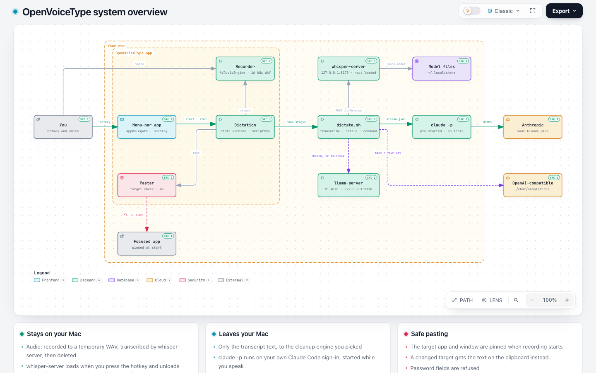
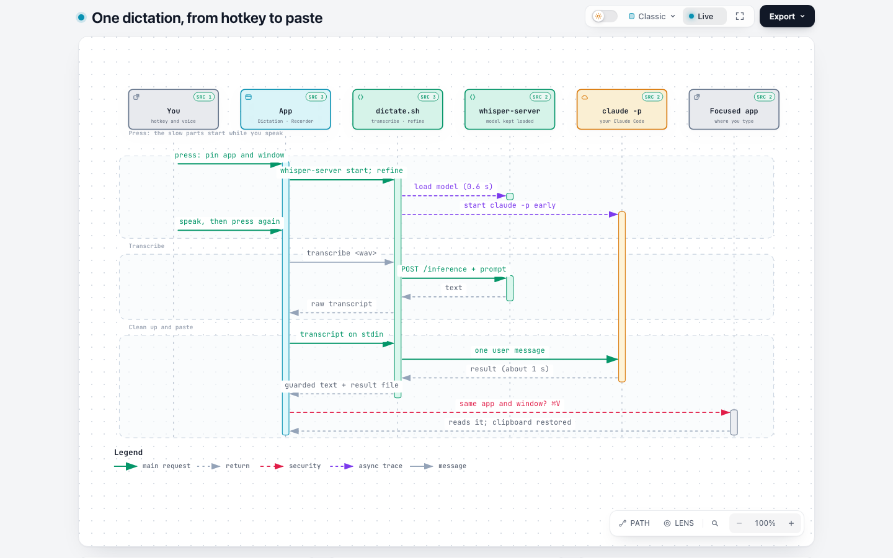
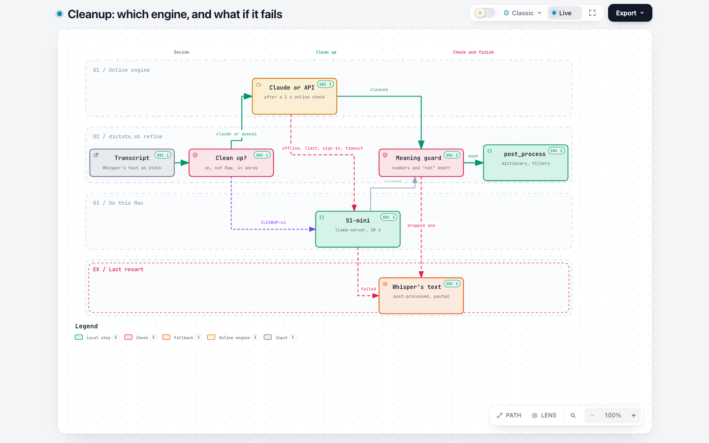
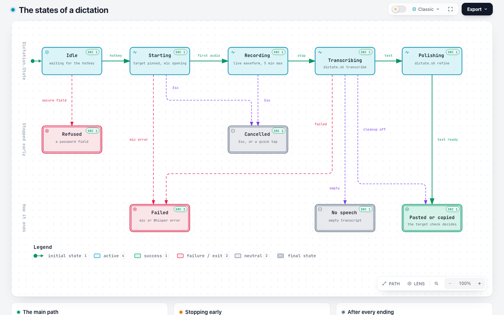
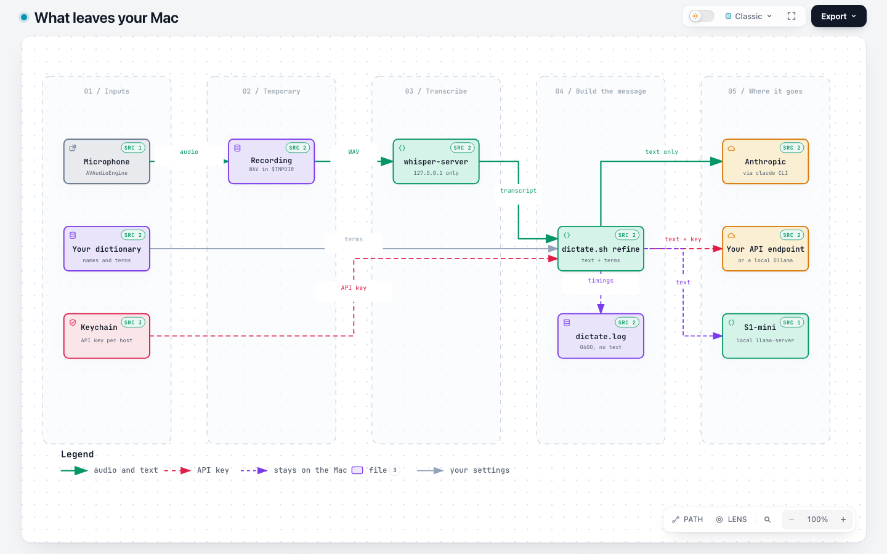
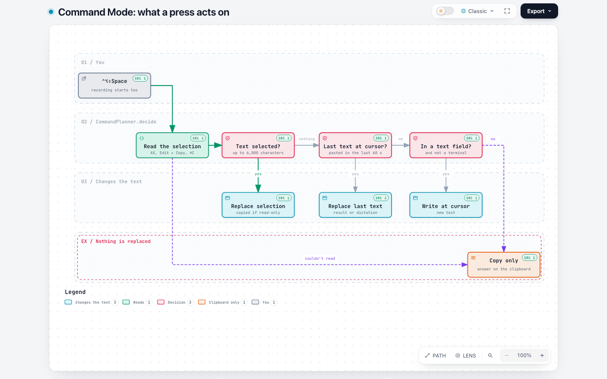

# How OpenVoiceType works, in diagrams

Six diagrams, each answering one question. Every box names the code it comes from: in the interactive page, a box's
**SRC** badge links to those lines on GitHub, at the commit the diagram was traced from (`1fe87ef`, v0.5.0).

Each diagram is an interactive page (`.html`): light and dark themes, search, focus on one box and what it connects to,
route tracing, and PNG/SVG export. GitHub shows `.html` files as source, so to explore one, download it (**Download raw
file** on its GitHub page) or clone the repository, and open it in a browser. It needs no network.

| Diagram | The question |
|---|---|
| [System overview](#system-overview) | What are the parts, and which run on the Mac vs online? |
| [One dictation, from hotkey to paste](#one-dictation-from-hotkey-to-paste) | What happens between the key press and the text, and why is it fast? |
| [Cleanup: which engine, and what if it fails](#cleanup-which-engine-and-what-if-it-fails) | Who cleans up the text, and what happens when Claude is offline or limited? |
| [The states of a dictation](#the-states-of-a-dictation) | What states does a dictation go through, and how does each one end? |
| [What leaves your Mac](#what-leaves-your-mac) | Where do the audio, the text, your API key and the logs go? |
| [Command Mode: what a press acts on](#command-mode-what-a-press-acts-on) | Does a command replace the selection, your last text, write new text, or only copy? |

## System overview

The menu-bar app records and pastes; `dictate.sh` transcribes with a local `whisper-server` and cleans up with
`claude -p`, an OpenAI-compatible endpoint, or S1-mini in a local `llama-server`.

<picture>
  <source media="(prefers-color-scheme: dark)" srcset="images/system-overview-dark.png">
  
</picture>

[Interactive page](system-overview.html) · [source](system-overview.json)

## One dictation, from hotkey to paste

Whisper and Claude start while you speak, so after you stop only the transcription and Claude's answer are left.

<picture>
  <source media="(prefers-color-scheme: dark)" srcset="images/dictation-sequence-dark.png">
  
</picture>

[Interactive page](dictation-sequence.html) · [source](dictation-sequence.json)

## Cleanup: which engine, and what if it fails

A dictation is never lost: an unavailable online engine falls back to S1-mini, and S1-mini or the meaning guard fall
back to Whisper's own text. The exit codes are what the app reads.

<picture>
  <source media="(prefers-color-scheme: dark)" srcset="images/cleanup-fallback-dark.png">
  
</picture>

[Interactive page](cleanup-fallback.html) · [source](cleanup-fallback.json)

## The states of a dictation

`Dictation.State` from Idle to Polishing, and the six ways a dictation ends. Every ending returns to Idle.

<picture>
  <source media="(prefers-color-scheme: dark)" srcset="images/dictation-states-dark.png">
  
</picture>

[Interactive page](dictation-states.html) · [source](dictation-states.json)

## What leaves your Mac

Audio, the recording, your dictionary and the logs stay on the Mac. Only the text goes out, and only to the engine
you picked.

<picture>
  <source media="(prefers-color-scheme: dark)" srcset="images/privacy-dataflow-dark.png">
  
</picture>

[Interactive page](privacy-dataflow.html) · [source](privacy-dataflow.json)

## Command Mode: what a press acts on

Decided when you press ⌃⌥⇧Space, before you've finished speaking; the overlay shows the answer.

<picture>
  <source media="(prefers-color-scheme: dark)" srcset="images/command-mode-planner-dark.png">
  
</picture>

[Interactive page](command-mode-planner.html) · [source](command-mode-planner.json)

## Changing a diagram

The `.json` files are the source; the pages and images are generated by [Archify](https://github.com/tt-a1i/archify)
(MIT), pinned in the script. You need Node 18+ and Chrome.

```bash
./scripts/render-diagrams.sh                   # all of them (the first run fetches Archify, about 80 MB)
./scripts/render-diagrams.sh system-overview   # one
./scripts/render-diagrams.sh --check           # only validate: schema, layout, and the source references
```

Each render must pass Archify's showcase checks (layout, labels, a real-browser check in both themes). The screenshots
are replaced only when the page changed.

**When the code changes**, a diagram's line references still point at its pinned commit, so they stay valid. When a
change affects what a diagram shows, update the JSON, set `meta.repository.revision` to a commit that has the new code
(a commit on `master`, since the links go to GitHub), fix the line numbers, and re-render.
